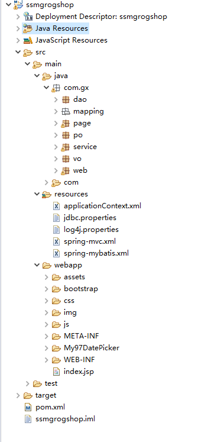
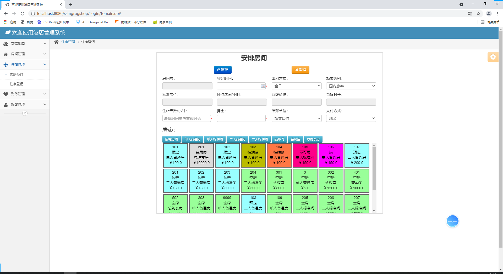
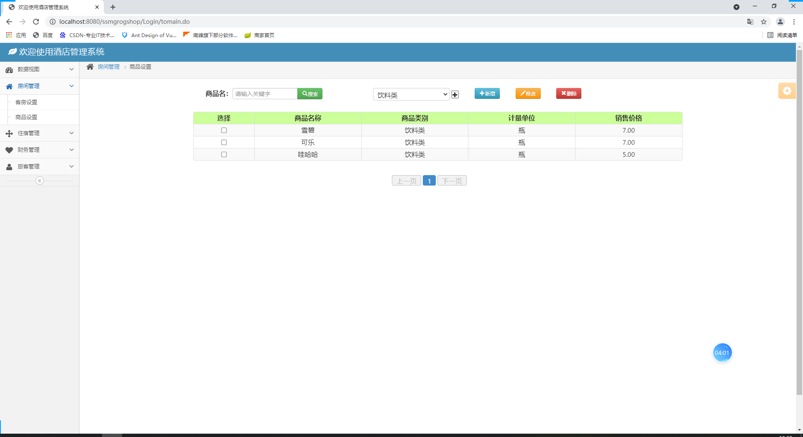
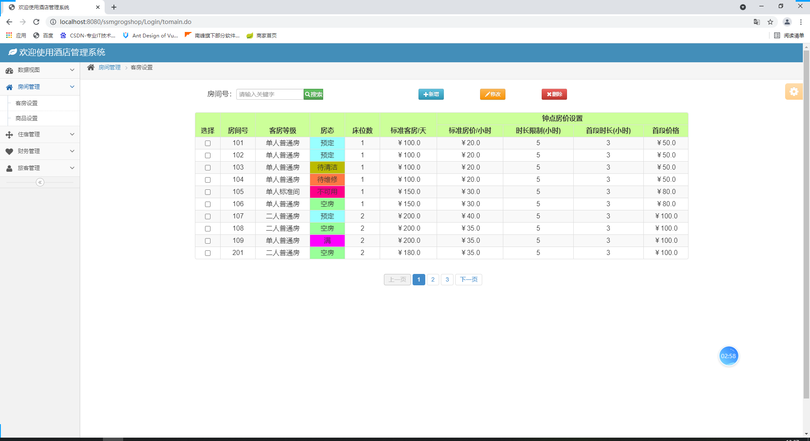
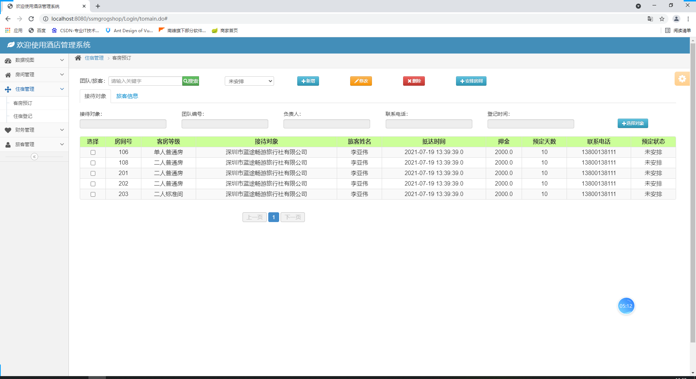
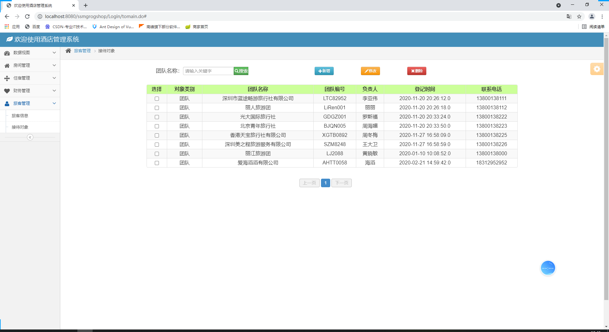
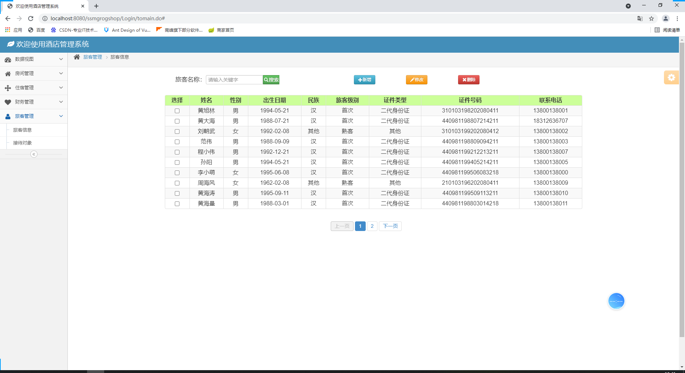
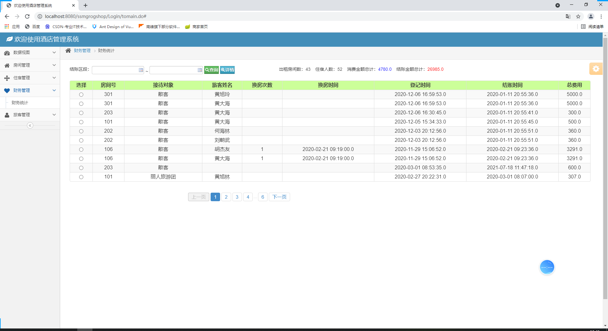
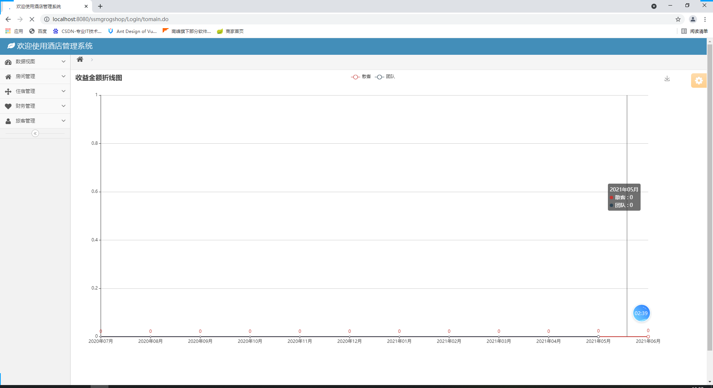

本系统是基于ssm的酒店管理系统

项目代码已收录公众号【java项目源码】，需要请自行关注一下公众号并下载源码

技术框架：spring，springmvc,mybatis，mysql,bootstrap，echarts

功能：

营业金额图表统计、客房设置、商品设置、客房预订、住宿登记、换房、押金、消费、结账、安排房价、财务统计、
旅客管理、接待对象管理

CSDN博客地址：[基于ssm的酒店管理系统](https://blog.csdn.net/mataodehtml/article/details/118876634)

运行视频地址：[基于ssm的酒店管理系统](https://www.bilibili.com/video/BV1H64y1z7XU)

管理员：

